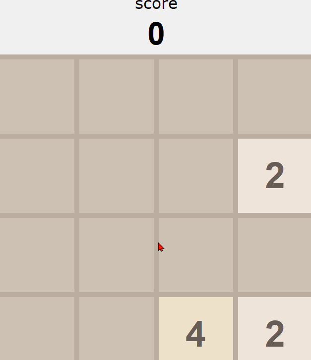

# 2048

Simple 2048 game

# Project - *2048*

**2048** is a game that combine the same number in to a bigger number to get the scores.By using the arrow key you will be able to move the numbers around in order to combine them into a bigger number

Submitted by: **Zhuohao Tan**

Time spent: **8** hours spent in total

This project bulit by following the tutorial on Youtube (python and Tkinter): https://www.youtube.com/watch?v=b4XP2IcI-Bg

## User Stories

The following **required** functionality is completed:

* [x] User can **view a game layout**.
* [x] User can **combine the same numbers can be add up to a bigger number**.
* [x] User can **use arrows key to manipulate the numbers** .

## Video Walkthrough

Here's a walkthrough of implemented user stories:

GIF created with [LiceCap](http://www.cockos.com/licecap/).

## Notes

Creating the layout of the game by only using code

Thinking about the ways to added all the numbers in different rows and colmuns
